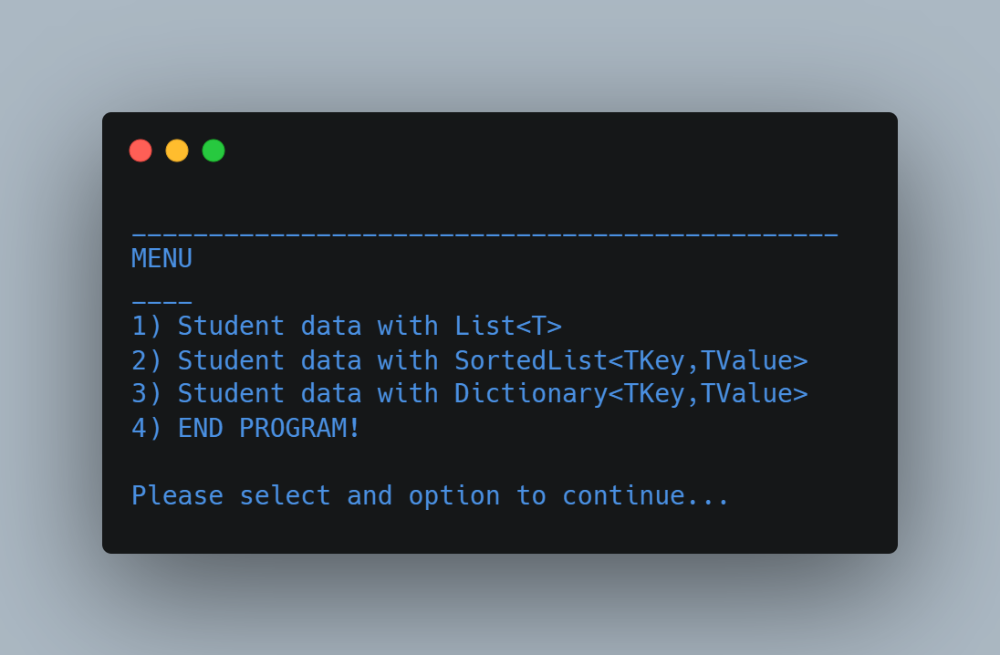
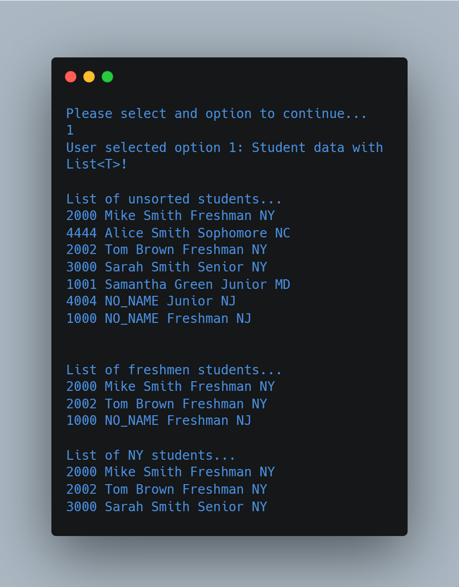
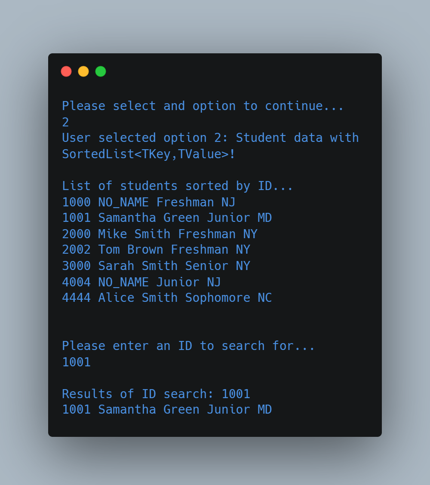
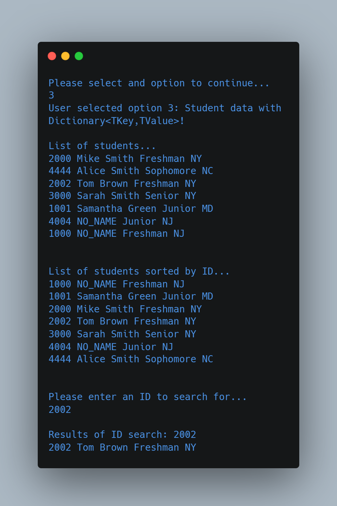

# SortedList and Dictionary

(FSC-BCS-426-Lab9)

## Output Menu

## Assignment Context

This project was one of the later assignments for my C# Programming class.

The goal of this assignment was to further explore C# by using lists, sorted lists, and ToLookup.

This was a solo assignment made with C#, and Visual Studio 2022.

## Features

This program demonstrates the use of three different collection classes in .NET Framework for storing and searching student data. 
The program creates a menu with four options:

* (1) displaying a list of unsorted students using List<T>
* (2) displaying a list of sorted students using SortedList<TKey,TValue>
* (3) displaying a list of sorted students using Dictionary<TKey,TValue>
* (4) ending the program

The program uses a while loop to keep the menu running until the user chooses to end the program. 
The user enters a number to select an option, and the program uses a switch statement to execute the appropriate code for the selected option.

## How It Works

### Option 1: Display a list of unsorted students using List<T>

The program initializes a `List<Student>` object called `studentsList`, which is used to store instances of a custom `Student` class defined within the program. 
The program creates several instances of the Student class with different data and adds them to the list using the `Add` method. 
It then displays the entire list of students using a `foreach` loop.
The program also uses the `ToLookup` method to create two lookup tables based on student status and state, which are stored in `lookupStatus` and `lookupState` variables, respectively. 
These lookup tables allow for efficient searching of the student list based on the status or state of each student. 
The program then prints the results of two searches, one for freshman students and another for students from NY, using `foreach` loops and the appropriate lookup table.

#### Output

### Option 2: Student data with SortedList<TKey,TValue>

This option initializes a `SortedList<int, Student>` object called `studentsSortedList`, which is used to store instances of the custom `Student` class defined within the program. 
The program creates several instances of the `Student` class with different data and adds them to the sorted list using their ID as the key. 
It then displays the entire list of students sorted by ID using a `foreach` loop and the `Values` property of the sorted list.
The program prompts the user to enter an ID to search for using the `Console.ReadLine` method, and stores the result in the `searchSortedID` variable. 
It then attempts to retrieve the student with the corresponding ID using the `[]` indexing operator and the `KeyNotFoundException` exception handling construct. 
If the ID is found, the program prints the corresponding student data using the `ToString` method of the `Student` class; otherwise, it prints an error message.

#### Output

### Option 3: Student data with Dictionary<TKey,TValue>

This option initializes a `Dictionary<int, Student>` object called `studentsDictionary`, which is used to store instances of the custom `Student` class defined within the program. 
The program creates several instances of the `Student` class with different data and adds them to the dictionary using their ID as the key. 
It then displays the entire dictionary of students using a `foreach` loop and the `Values` property of the dictionary.
The program uses a LINQ query to sort the dictionary by ID and prints the sorted results using a `foreach` loop and the `KeyValuePair` class. 
The program prompts the user to enter an ID to search for using the `Console.ReadLine` method, and stores the result in the `searchDictionaryID` variable. 
It then attempts to retrieve the student with the corresponding ID using the `[]` indexing operator and the `KeyNotFoundException` exception handling construct. 
If the ID is found, the program prints the corresponding student data using the `ToString` method of the `Student` class; otherwise, it prints an error message.

#### Output

### Option 4: End the program

This option sets the programRunning variable to false, causing the while loop to exit and the program to end.
